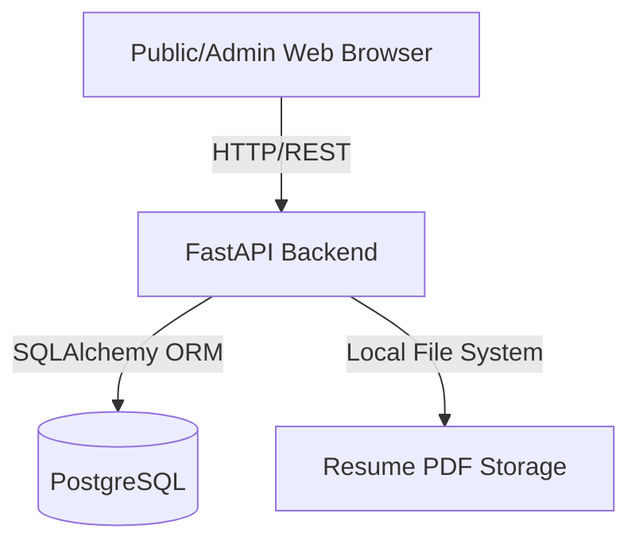

# High-Level Design (HLD)
## AI-Powered Personal Portfolio

### 1. Introduction
This document outlines the high-level architecture of the AI-powered personal portfolio. The system serves dual purposes: 
1. Presenting the user's professional portfolio to the public.
2. Allowing HR professionals to paste Job Descriptions (JDs) and receive an AI-calculated suitability match based on the portfolio data.

### 2. System Architecture

The application follows a standard modern decoupled web architecture:
- **Frontend (Client)**: React Single Page Application (SPA) built with Vite, TypeScript, and Tailwind CSS.
- **Backend (API Layer)**: FastAPI server providing RESTful endpoints.
- **Database (Persistence Layer)**: PostgreSQL relational database.

#### Component Diagram

### 3. Data Flow
1. **Public Browsing**: The frontend requests portfolio data via generic `GET` endpoints. The backend queries PostgreSQL and returns JSON.
2. **JD Matching**: A recruiter submits JD text via the `POST /api/v1/jd-match` endpoint. The backend extracts skills and computes a matching algorithm against the known Profile/Skills in the database, saves the query for analytics, and returns the score.
3. **Admin Management**: The owner logs in via `/api/v1/admin/login` using JWT authentication. They perform CRUD operations and upload their resume.

### 4. Security & Rate Limiting
- **Public API**: Secured against abuse via `slowapi` rate limiting (e.g., 5 requests/hour for JD Match).
- **Admin API**: Secured using JWT Bearer tokens and bcrypt password hashing.

### 5. Deployment
- **Docker Compose**: Container orchestration running `frontend`, `backend`, and `postgres` services interconnected on a private Docker network.
